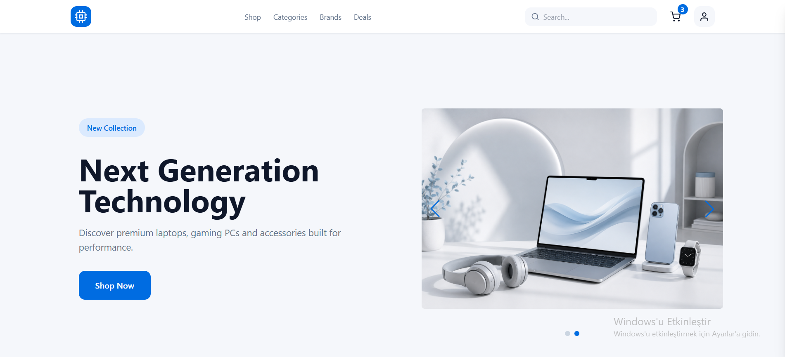
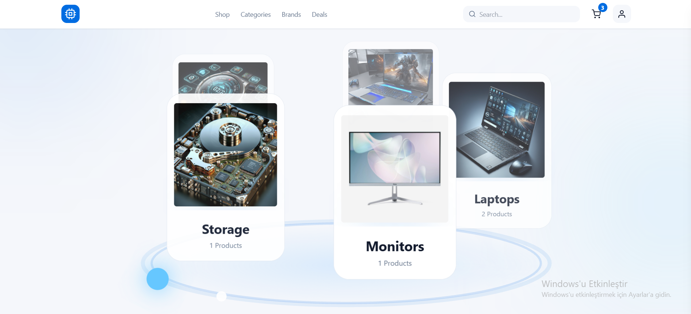
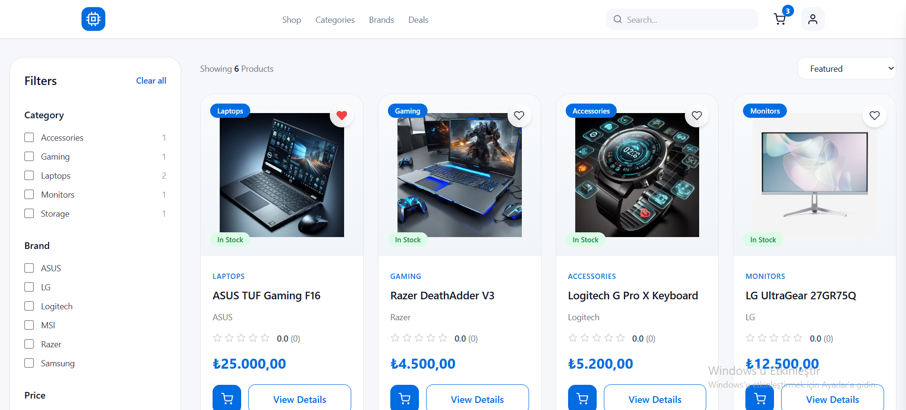
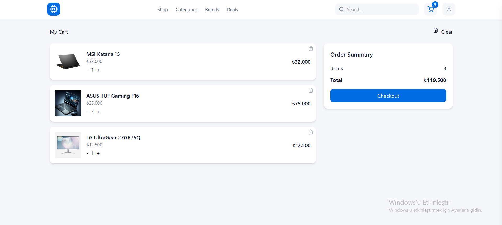
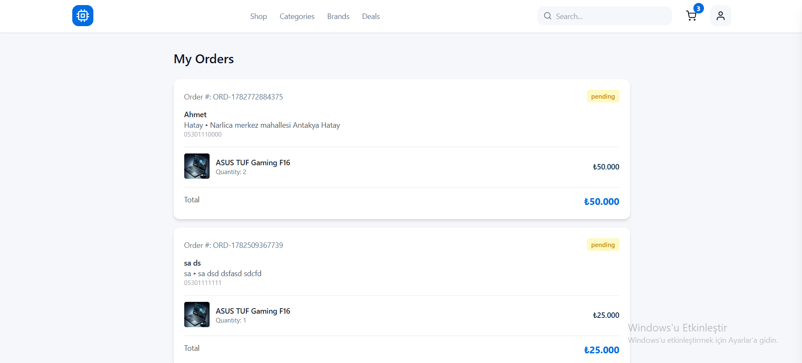
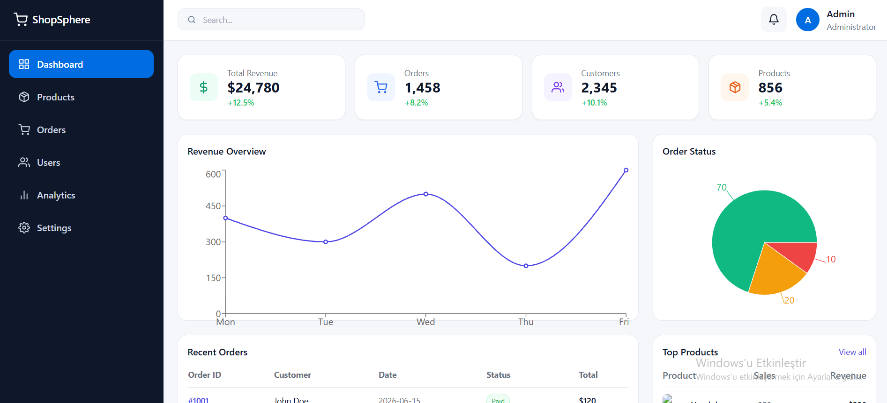

<p align="center">
  
</p>

# 🛍️ Novatech Store


A modern **Full-Stack E-Commerce** application built with **React, TypeScript, Node.js, Express.js and MongoDB**.

Novatech Store was developed to strengthen my full-stack development skills by building a real-world e-commerce application from scratch. The project focuses on clean architecture, reusable components, responsive design, authentication, product management and an evolving admin dashboard.

---

# 🚀 Live Demo

<p align="center">

[](https://ecommerce-frontend-lyart-one.vercel.app/)

</p>
---

# 📑 Table of Contents

* Project Overview
* Features
* Tech Stack
* Architecture
* Project Structure
* Installation
* Environment Variables
* Learning Outcomes
* Roadmap

---

# 📖 Project Overview

Novatech Store is a responsive MERN-style e-commerce application that simulates the core functionality of a modern online shopping platform.

Users can create an account, securely authenticate, browse products, filter and sort items, manage their shopping cart, complete a checkout flow, place orders and manage their account.

The project also includes an admin dashboard architecture that is currently being redesigned and expanded.

---

# ✨ Features

## 🔐 Authentication

* User registration
* User login
* JWT authentication
* Protected routes
* Persistent authentication
* Role-based authorization
* Secure password hashing using bcrypt

---

## 🛒 Shopping Experience

* Browse products
* Product detail page
* Shopping cart
* Checkout page
* Order history
* Wishlist support
* Responsive shopping experience

---

## 🔎 Product Discovery

* Filter by category
* Filter by brand
* Filter by availability
* Filter by price
* Sort by newest
* Sort by price (Low → High)
* Sort by price (High → Low)
* Sort by popularity

---

## 🎨 User Experience

* Responsive design
* Skeleton loading screens
* Toast notifications
* Animated landing page
* Custom SVG Orbit animation
* Popular Categories section
* Modern UI built with Tailwind CSS

---

## 👨‍💼 Admin

* Dashboard architecture
* Role-based admin access
* Product management structure

> The admin dashboard is currently being redesigned with a more modern UI and additional analytics features.

---

# 🛠️ Tech Stack

## Frontend

* React
* TypeScript
* Vite
* Tailwind CSS
* React Router
* Axios
* React Hook Form
* Zod
* React Hot Toast
* Swiper
* Recharts
* React Icons

---

## Backend

* Node.js
* Express.js
* MongoDB
* Mongoose
* JWT Authentication
* bcrypt
* CORS
* dotenv

---

# 🏗️ Architecture

```text
            React + TypeScript
                    │
                 Axios API
                    │
          Express.js REST API
                    │
        Controllers & Services
                    │
                MongoDB
```

---

# 📁 Project Structure

```text
e-commerce/
│
├── frontend/
│   ├── components
│   ├── context
│   ├── hooks
│   ├── layouts
│   ├── pages
│   ├── services
│   ├── types
│   ├── utils
│   └── validation
│
└── backend/
    ├── config
    ├── controllers
    ├── middleware
    ├── models
    ├── routes
    ├── services
    └── utils
```

---

# ⚙️ Installation

## Clone the repository

```bash
git clone https://github.com/dania8shaghouri/e-commerce.git
```

---

## Backend

```bash
cd backend

npm install

npm run dev
```

Create a `.env` file

```env
MONGODB_URI=

JWT_SECRET=
```

---

## Frontend

```bash
cd frontend

npm install

npm run dev
```

---

# 🌱 Learning Outcomes

Throughout this project I improved my knowledge of:

* Building scalable React applications
* Developing RESTful APIs
* JWT authentication and authorization
* Context API state management
* TypeScript best practices
* Form validation using React Hook Form and Zod
* Reusable component architecture
* Responsive UI development
* Full-stack application deployment
* Client–server communication
* Modern project organization

---

# 🚧 Roadmap

Planned improvements include:

* Stripe payment integration
* Wishlist page
* Product reviews and ratings
* Order tracking
* Email verification
* Password reset
* Coupon system
* Search suggestions
* Advanced admin analytics
* AI-powered product recommendations
* Docker support
* Unit & integration testing
* CI/CD pipeline

---

# 📷 Screenshots

Explore some of the key pages of **Novatech Store**.

### 🏠 Home & Shop

| Home | Shop |
|------|------|
|  |  |

---

### 🛒 Shopping Experience

| Cart | Orders |
|------|------|
|  |  |

---

### 👨‍💼 Admin Dashboard

<p align="center">
  
</p>
---


