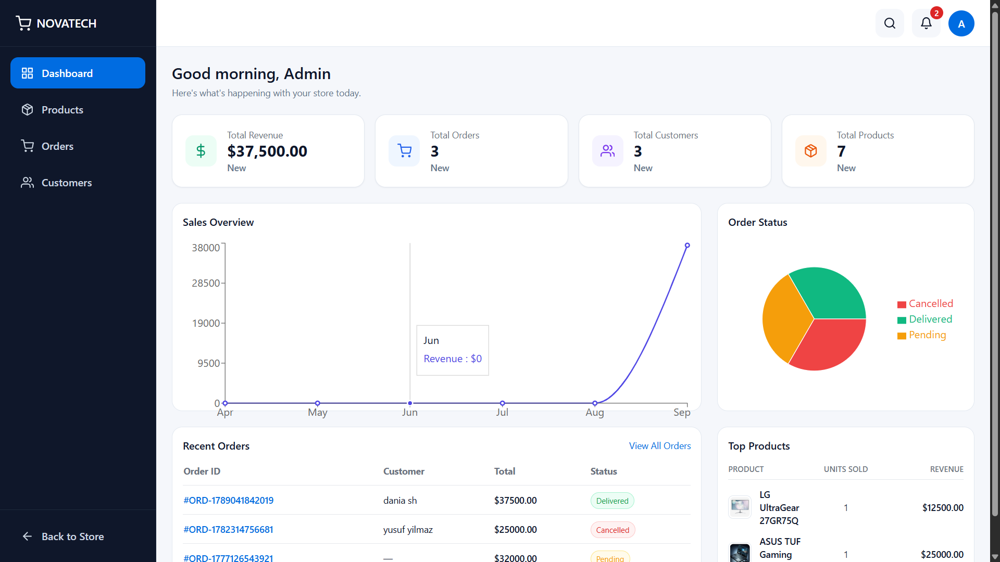

<p align="center">
  
</p>

# 💻 Novatech Store


A modern **Full-Stack E-Commerce** application built with **React, TypeScript, Node.js, Express.js and MongoDB** — with an integrated Stripe payment system and a complete admin dashboard.

 Novatech Store was developed to strengthen my full-stack development skills by building a real-world e-commerce application from scratch. The project focuses on clean architecture, reusable components, responsive design, authentication, a full payment flow, and a data-driven admin dashboard for managing the store.

# 🚀 Live Demo

<p align="center">

[](https://ecommerce-frontend-lyart-one.vercel.app/)

## </p>

# 📑 Table of Contents

- Project Overview
- Features
- Tech Stack
- Architecture
- Project Structure
- Installation
- Environment Variables
- Learning Outcomes
- Roadmap

---

# 📖 Project Overview

Novatech Store is a responsive MERN-style e-commerce application that simulates the core functionality of a modern online shopping platform.

Users can create an account, securely authenticate, browse products, filter and sort items, manage their shopping cart, pay through a real Stripe checkout flow, and track their orders.

On the admin side, the store owner has a fully data-driven dashboard to manage products, fulfill orders, view customer insights, and monitor store performance in real time — no mock data anywhere in the admin panel.

---

# ✨ Features

## 🔐 Authentication

- User registration
- User login
- JWT authentication
- Protected routes
- Persistent authentication
- Role-based authorization (customer / admin)
- Secure password hashing using bcrypt

---

## 🛒 Shopping Experience

- Browse products
- Product detail page
- Shopping cart
- Checkout with Stripe's hosted payment page
- Real-time payment status confirmation (success / cancel pages)
- Order history
- Wishlist support
- Responsive shopping experience

---

## 💳 Payments (Stripe)

- Stripe Checkout Sessions for secure, PCI-compliant payments
- Webhook-based payment confirmation (checkout.session.completed) with signature verification
- Order paymentStatus and status synced automatically once payment is confirmed
- Local development tested end-to-end with the Stripe CLI

---

## 🔎 Product Discovery

- Filter by category
- Filter by brand
- Filter by availability
- Filter by price
- Sort by newest
- Sort by price (Low → High)
- Sort by price (High → Low)
- Sort by popularity

---

## 🎨 User Experience

- Responsive design
- Skeleton loading screens
- Toast notifications
- Animated landing page
- Custom SVG Orbit animation
- Popular Categories section
- Modern UI built with Tailwind CSS

---


## 👨‍💼 Admin Dashboard

### Products

- Full CRUD with a dedicated Add/Edit page
- Dynamic, category-specific specification fields
- Drag-and-drop multi-image upload
- Search, filters, sorting, and pagination

### Orders

- Order status lifecycle management
- Order detail page
- Customer and shipping information
- Payment status
- Status timeline
- Search, filters, sorting, and pagination

### Customers

- Customer statistics using MongoDB aggregation
- Total orders and total spent
- Average order value
- Customer detail page
- Full order history

### Dashboard Analytics

- Revenue, orders, customers, and products KPIs
- Month-over-month changes
- 6-month revenue trend chart
- Order status breakdown
- Recent orders
- Top-selling products

### Additional Admin Features

- Global search across products, orders, and customers
- Polling-based notifications
- Low-stock alerts
---


# 🛠️ Tech Stack

## Frontend

- React 19.2.4
- React DOM 19.2.4
- TypeScript 5.9
- Vite 8
- Tailwind CSS 3.4
- React Router DOM 7
- Axios 1.14
- React Hook Form 7
- Zod 4
- Recharts 3
- Swiper 14
- React Hot Toast 2
- React Icons 5

## Backend

- Node.js
- Express.js 5
- TypeScript 5.9
- MongoDB
- Mongoose 9
- JWT Authentication
- bcrypt 6
- Stripe 22
- Multer 2
- Zod 4
- CORS
- Helmet
- express-rate-limit
- dotenv

## Development Tools

- ESLint 9
- TypeScript ESLint 8
- tsx
- Nodemon
- PostCSS
- Autoprefixer

---

# 🏗️ Architecture

```text
            React + TypeScript (customer + admin)
                    │
                 Axios API
                    │
          Express.js REST API
                    │
        Controllers → Services → Models
                    │
            MongoDB   Stripe (payments)

```

---

# 📁 Project Structure

```text
e-commerce/
│
├── frontend/
│   ├── components
│   ├── context
│   ├── hooks
│   ├── layouts
│   ├── pages
│   ├── features/admin
│   ├── services
│   ├── types
│   ├── utils
│   └── validation
│
└── backend/
    ├── config
    ├── controllers
    ├── middleware
    ├── models
    ├── routes
    ├── services
    └── utils
```

---


# ⚙️ Installation

## Prerequisites

Make sure you have the following installed:

- Node.js
- npm
- MongoDB Atlas account
- Stripe account (for payment features)

## Clone the repository

```bash
git clone https://github.com/dania8shaghouri/e-commerce.git
cd e-commerce
```

## Backend Setup

Open a terminal in the project root:

```bash
cd backend
npm install
```

Create a `.env` file inside the `backend/` directory.

Add the required environment variables:

```env
MONGODB_URI=
JWT_SECRET=
PORT=3001
ALLOWED_ORIGINS=http://localhost:5173

STRIPE_SECRET_KEY=
STRIPE_WEBHOOK_SECRET=
FRONTEND_URL=http://localhost:5173
```

Start the backend development server:

```bash
npm run dev
```

## Frontend Setup

Open a new terminal in the project root:

```bash
cd frontend
npm install
npm run dev
```

The frontend will run on the local development URL provided by Vite.

---

🌱 Learning Outcomes

Throughout this project I improved my knowledge of:

- Building scalable React applications
- Developing RESTful APIs
- JWT authentication and authorization
- Integrating third-party payment systems (Stripe Checkout + webhooks)
- MongoDB aggregation pipelines for computed, data-driven views
- Context API state management
- TypeScript best practices (incl. resolving react-hook-form/Zod type edge cases)
- Form validation using React Hook Form and Zod
- Reusable component architecture (no prop drilling, shared components generalized on reuse)
- Responsive UI development
- Full-stack application deployment (Vercel + Render)
- Diagnosing real production issues (e.g. ephemeral filesystem storage on Render, webhook signature verification)
- Client–server communication
- Modern project organization

---


# 🚧 Roadmap

Planned improvements include:

### Testing & Quality

- Unit testing with Jest
- Component testing with React Testing Library
- Integration testing
- CI/CD pipeline with GitHub Actions

### Infrastructure

- Cloudinary migration for image uploads
- Docker support
- Production Stripe webhook registration

### E-Commerce Features

- Dedicated wishlist page (if not completed)
- Product reviews and ratings
- Real shipping cost and discount system
- Coupon system
- Search suggestions
- Email verification
- Password reset

### Admin Improvements

- Mark as Paid manual override
- Order status history with per-step timestamps
- Settings & Analytics pages

### Future Improvements

- AI-powered product recommendations
---

# 📷 Screenshots

Explore some of the key pages of **Novatech Store**.

### 🏠 Home & Shop

| Home                             | Shop                             |
| -------------------------------- | -------------------------------- |
|  |  |

---

### 🛒 Shopping Experience

| Cart                             | Orders                             |
| -------------------------------- | ---------------------------------- |
|  |  |

---

### 👨‍💼 Admin Dashboard

<p align="center">
  
</p>
---
